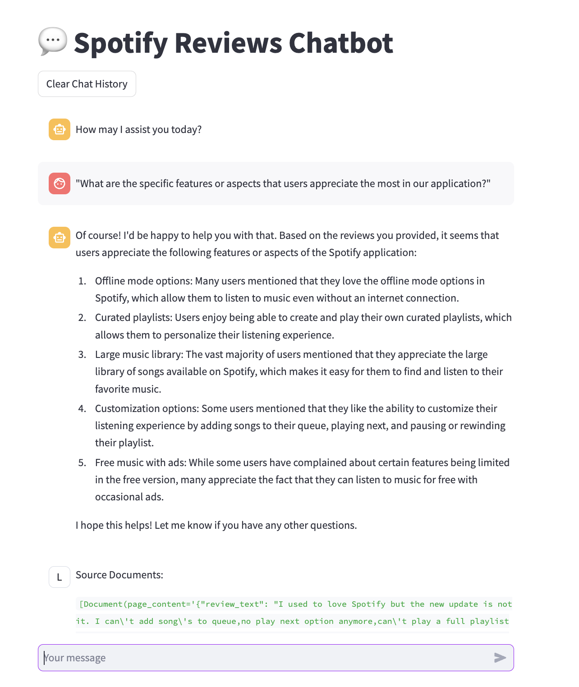

# spotify-reviews-qa

# Prerequisites

1. Install [Docker](https://docs.docker.com/get-docker/)

# How-to-Use

## Run Local LLama2 Model

1. Make sure you have Docker installed on your machine
2. Open up a terminal and run docker container

   ```
   docker run -d -v ollama:/root/.ollama -p 11434:11434 --name ollama ollama/ollama
   ```

3. Open up a terminal and pull Llama2 latest model
   ```
   curl http://localhost:11434/api/pull -d '{
     "name": "llama2"
   }'
   ```

## Run Spotify Reviews QA Chatbot

1. Clone this repo
2. Install project requirements

   ```
   pip install -r requirements.txt
   ```
3. Go to `spotify-reviews-qa/playgrounds` directory, and start Streamlit app

   ```
   streamlit run streamlit_app.py --server.port 8501
   ```
4. Open up your browser and access the chatbot on `http://localhost:8501`


# Screenshot & Demo


